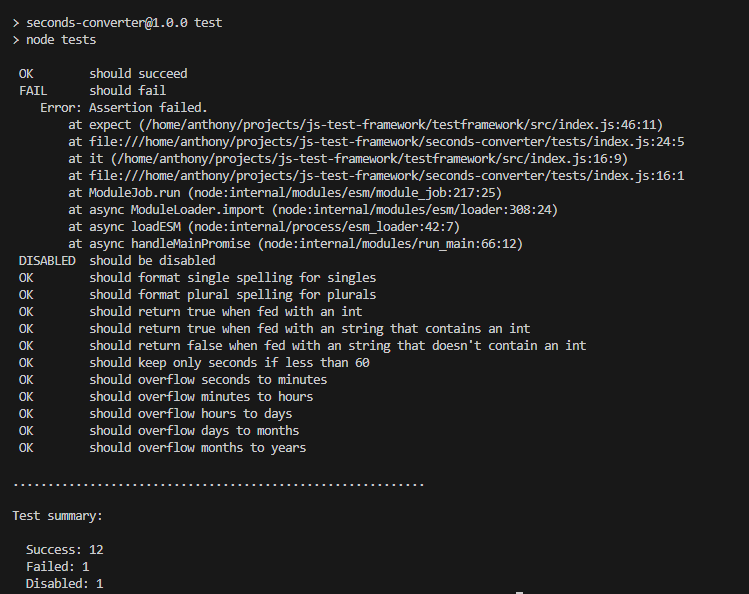
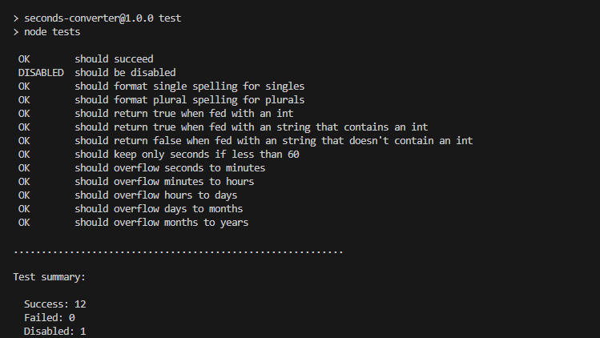

# Homemade testing framework
This testing framework was made for a school assignment. The testing framework lives inside of the `testframework` folder, while in the `seconds-converter` there is a dummy project, with test cases for most of the code writtin inside it.

This testframework by no means replaces a traditional testing framework, because those are way more robust and featurefull. However it was interesting to see how little was needed for a small testing framework.

## How to setup
1. Install the right node version
```cmd
nvm install
nvm use
```
2. Make the testing framework globally linkable
```cmd
cd testframework
npm link
```
3. Symlink the testing framework inside the project
```cmd
cd ../seconds-converter
npm link
```
4. Run the tests!
```cmd
npm test
```

## Results
With a failing test inside the test suite


Without a failing test inside the test suite

